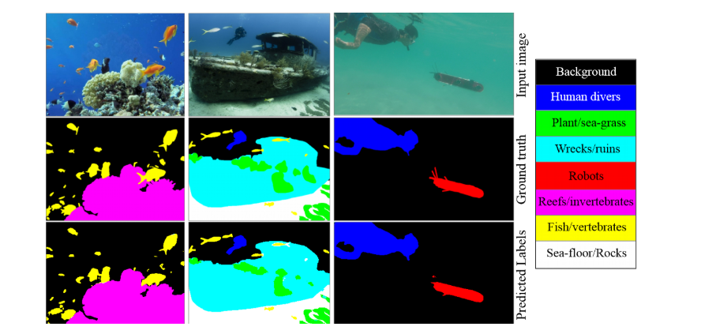

# Projekt: Under Water Image Segmentation

Dieses Projekt entstand im Rahmen des Moduls Bildverarbeitung an der FHNW. Das Projekt handelt über die Segmentierung von Underwasser Bilder. Wir Implementieren hierbei
das [UNet](https://arxiv.org/pdf/1505.04597) sowie das [SuimNet](https://arxiv.org/pdf/2004.01241) und vergleichen diese auf ihre Performance

## **Resultate**

Das Ziel dieses Projekts war es, die beiden Modelle **UNet** und **SuimNet** hinsichtlich ihrer Leistung bei der Segmentierung von Unterwasserbildern zu vergleichen. Die Ergebnisse zeigen, dass das **UNet-Modell** eine deutlich bessere Performance erzielt als das SuimNet.

### **UNet**
- **Pixelgenauigkeit (Training):** Bis zu 0.8 erreicht.
- **Generalisation:** Leichte Verschlechterung auf den Testdaten, jedoch gute Generalisierung und stabile Ergebnisse.

### **SuimNet**
- **Pixelgenauigkeit (Training):** Werte unter 0.1 und keine Verbesserung während des Trainings.
- **Mögliche Ursache:** Die Implementierung des SuimNet-Modells weicht von der Originalarbeit ab (z. B. Parameteranzahl: 3.75M statt 3.83M).

### **Fazit**
Das UNet-Modell zeigt eine überlegene Leistung und erreicht auf Trainings- und Testdaten zuverlässige Ergebnisse. Das SuimNet hingegen hat signifikante Schwierigkeiten, was auf Implementierungsfehler oder Unterschiede zur Originalarchitektur hinweisen könnte.

### **Verbesserungsvorschläge**
- **SuimNet:** Eine Überprüfung und Optimierung der Implementierung ist erforderlich.
